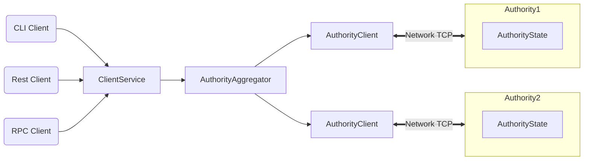

# Haneul Developer Portal

Welcome to Haneul, a next generation smart contract platform with high throughput, low latency, and an asset-oriented programming model powered by the [Move](https://github.com/GeunhwaJeong/awesome-move) programming language! Here are some suggested starting points:

* To jump right into building smart contract applications on top of Haneul, go to [Move Quick Start](https://github.com/GeunhwaJeong/fastnft/tree/main/doc/move.md).
* To experiment with a sample Haneul wallet, check out [Wallet Quick Start](https://github.com/GeunhwaJeong/fastnft/tree/main/doc/wallet.md).
<!---* To understand what's possible by browsing examples of full-fledged applications and games built on top of Haneul, review the [Demos](TODO).--->
* To understand what's possible by browsing Move code built on top of Haneul, review the [examples](https://github.com/GeunhwaJeong/fastnft/tree/main/haneul_programmability/examples/sources)
* To start coding against Haneul's REST API's, start [here](https://app.swaggerhub.com/apis/arun-koshy/haneul-api)
* To go deep on how Haneul works, understand [Key Concepts](https://github.com/GeunhwaJeong/fastnft/tree/main/doc/key-concepts.md).
* To learn what distinguishes Haneul from other blockchain systems, see [What Makes Haneul Different?](https://github.com/GeunhwaJeong/fastnft/tree/main/doc/what-makes-haneul-different.md).
<!---* To experience Haneul's speed and scalability for yourself, try [Benchmarking](TODO).--->
<!---* To see the current status of the Haneul software/network and preview what's coming next, read through our [Roadmap](TODO).--->

<!---TODO: Populate and link to the missing pages above or strike the links and references.--->

## Architecture

Haneul is a distributed ledger that stores a collection of programmable *[objects](https://github.com/GeunhwaJeong/fastnft/tree/main/doc/objects.md)*, each with a globally unique ID. Every object is owned by a single *address*, and each address can own an arbitrary number of objects.

The ledger is updated via a *[transaction](https://github.com/GeunhwaJeong/fastnft/tree/main/doc/transactions.md)* sent by a particular address. A transaction can create, destroy, and write objects, as well as transfer them to other addresses.

Structurally, a transaction contains a set of input object references and a pointer to a Move code object that already exists in the ledger. Executing a transaction produces updates to the input objects and (if applicable) a set of freshly created objects along with their owners. A transaction whose sender is address *A* can accept objects owned by *A*, shared objects, and objects owned by other objects in the first two groups as input.

Haneul authorities agree on and execute transactions in parallel with high throughput using [Byzantine Consistent Broadcast](https://en.wikipedia.org/wiki/Byzantine_fault).

## Move quick start
See the [Move Quick Start](https://github.com/GeunhwaJeong/fastnft/tree/main/doc/move.md) for installation, defining custom objects, object operations (create/destroy/update/transfer/freeze), publishing, and invoking your published code.
<!--- Then deeper: Haneul standard library, design patterns, examples. --->

## Wallet quick start
See the [Wallet Quick Start](https://github.com/GeunhwaJeong/fastnft/tree/main/doc/wallet.md) for installation, querying the chain, client setup, sending transfer transactions, and viewing the effects.
<!--- Then deeper: wallet CLI vs client service vs forwarder architecture, how to integrate your code (wallet, indexer, ...) with the client service or forwarder components. --->
