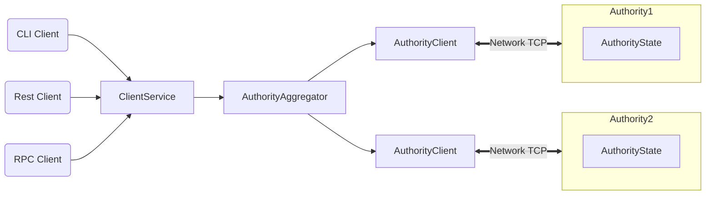

# Haneul README

|             |             |
| ----------- | ----------- |
| Welcome to Haneul, a next-generation smart contract platform with high throughput, low latency, and an asset-oriented programming model powered by the [Move programming language](https://github.com/GeunhwaJeong/awesome-move)! Find everything you need within the [Haneul Developer Guides](doc/src/learn/index.md) and supporting materials below.      |       |

## Quick links

* To learn how to use Haneul, take our [end-to-end tutorial](doc/src/explore/tutorials.md).
* To jump right into building smart contract applications on top of Haneul, start at the [Move Smart Contract Quick Start](doc/src/build/move.md).
* To experiment with a sample Haneul wallet, check out [Wallet Quick Start](doc/src/build/wallet.md).
* To understand what's possible by browsing Move code built on top of Haneul, review the [examples](doc/src/explore/examples.md).
* To start coding against Haneul's REST APIs, start at the [API reference](https://app.swaggerhub.com/apis/arun-koshy/haneul-api).
* To learn what distinguishes Haneul from other blockchain systems, see [How Haneul Differs?](doc/src/learn/haneul-compared.md).
* To go deep on how Haneul works, read the [Haneul Smart Contract Platform](doc/paper/haneul.pdf) white paper.
* To help Haneul grow, follow [Contributing to Haneul](doc/src/contribute/index.md).
* To connect with the Haneul community, join our [Discord](https://discord.gg/Gkh9xaWm).

### Highlights

Haneul offers:

* Unmatched scalability, instant settlement
* A safe smart contract language accessible to mainstream developers
* Ability to define rich and composable on-chain assets
* Better user experience for web3 apps

Haneul is the only blockchain today that can scale with the growth of web3 while achieving industry-leading performance, cost, programmability, and usability. As we push towards mainnet launch, we will demonstrate capacity beyond the transaction processing capabilities of established systems – traditional and blockchain alike. We see Haneul as the first internet-scale programmable blockchain platform, a foundational layer for web3.

## Architecture

## Overview

Haneul is a smart contract platform maintained by a permissionless set of authorities that play a role similar to validators or miners in other blockchain systems.

Haneul offers scalability and unprecedented low-latency for common use cases. Haneul makes the vast majority of transactions processable in parallel, which makes better use of processing resources, and offers the option to increase throughput with more resources. Haneul forgoes consensus to instead use simpler and lower-latency primitives for common use cases, such as payment transactions and assets transfer. This is unprecedented in the blockchain world and enables a number of new latency-sensitive distributed applications, ranging from gaming to retail payment at physical points of sale.

Haneul is written in [Rust](https://www.rust-lang.org) and supports smart contracts written in the [Move programming language](https://golden.com/wiki/Move_(programming_language)-MNA4DZ6)to define assets that may have an owner. Move programs define operations on these assets including custom rules for their creation, the transfer of these assets to new owners, and operations that mutate assets.

Haneul has a native token called HANEUL, with a fixed supply. The HANEUL token is used to pay for gas, and is also used as [delegated stake on authorities](https://learn.bybit.com/blockchain/delegated-proof-of-stake-dpos/) within an epoch. The voting power of authorities within this epoch is a function of this delegated stake. Authorities are periodically reconfigured according to the stake delegated to them. In any epoch the set of authorities is [Byzantine fault tolerant](https://pmg.csail.mit.edu/papers/osdi99.pdf). At the end of the epoch, fees collected through all transactions processed are distributed to authorities according to their contribution to the operation of the system. Authorities can in turn share some of the fees as rewards to users that delegated stake to them.

Haneul is backed by a number of state-of-the-art [peer-reviewed works](https://github.com/GeunhwaJeong/haneul/blob/main/doc/src/contribute/research-papers.md) and years of open source development.
