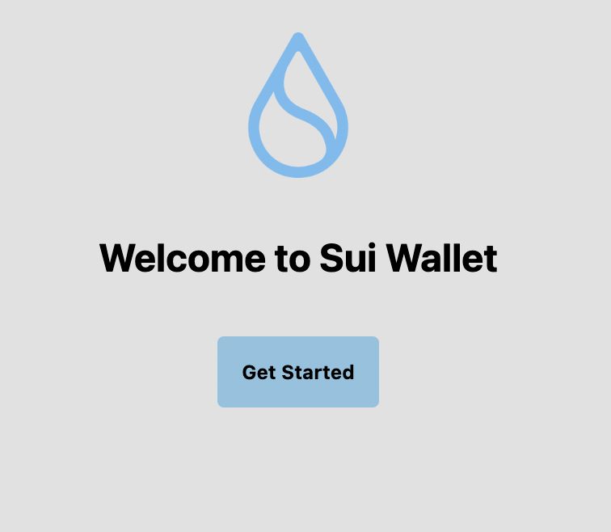
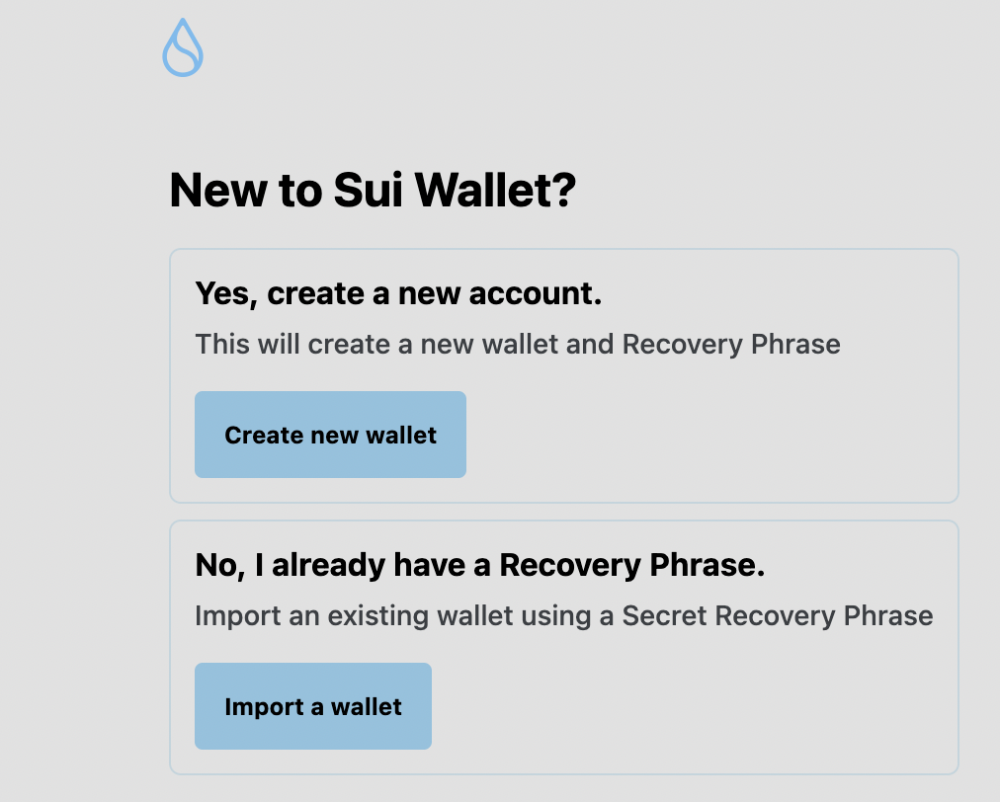
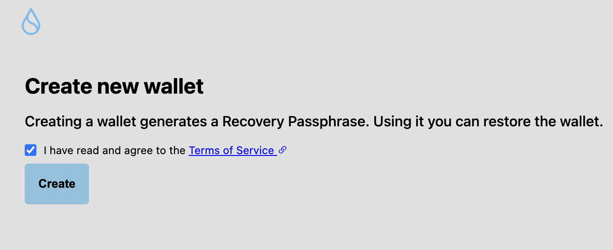
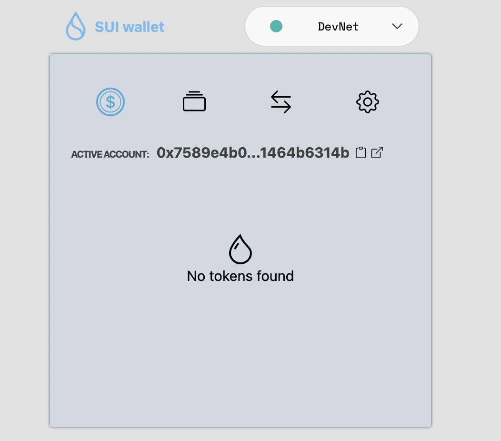
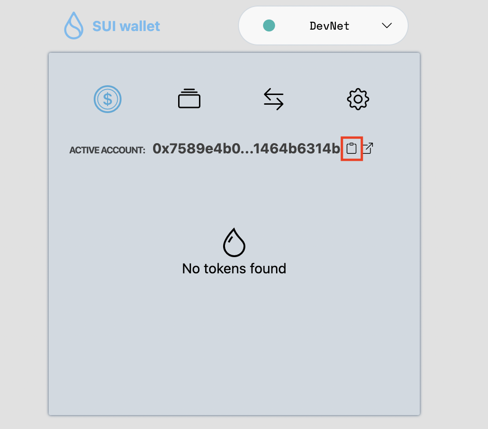
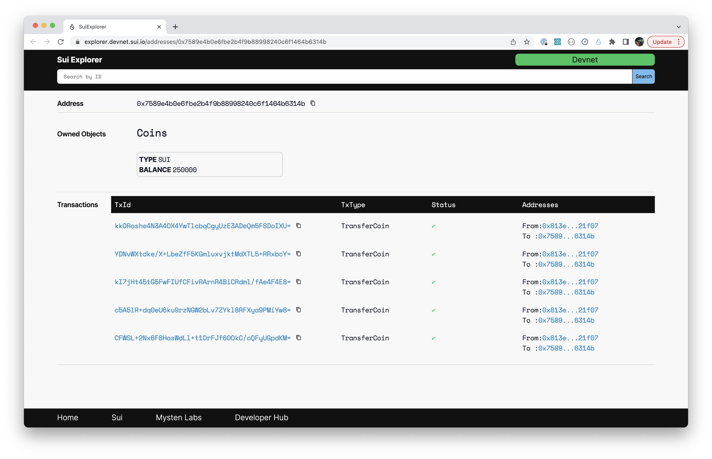
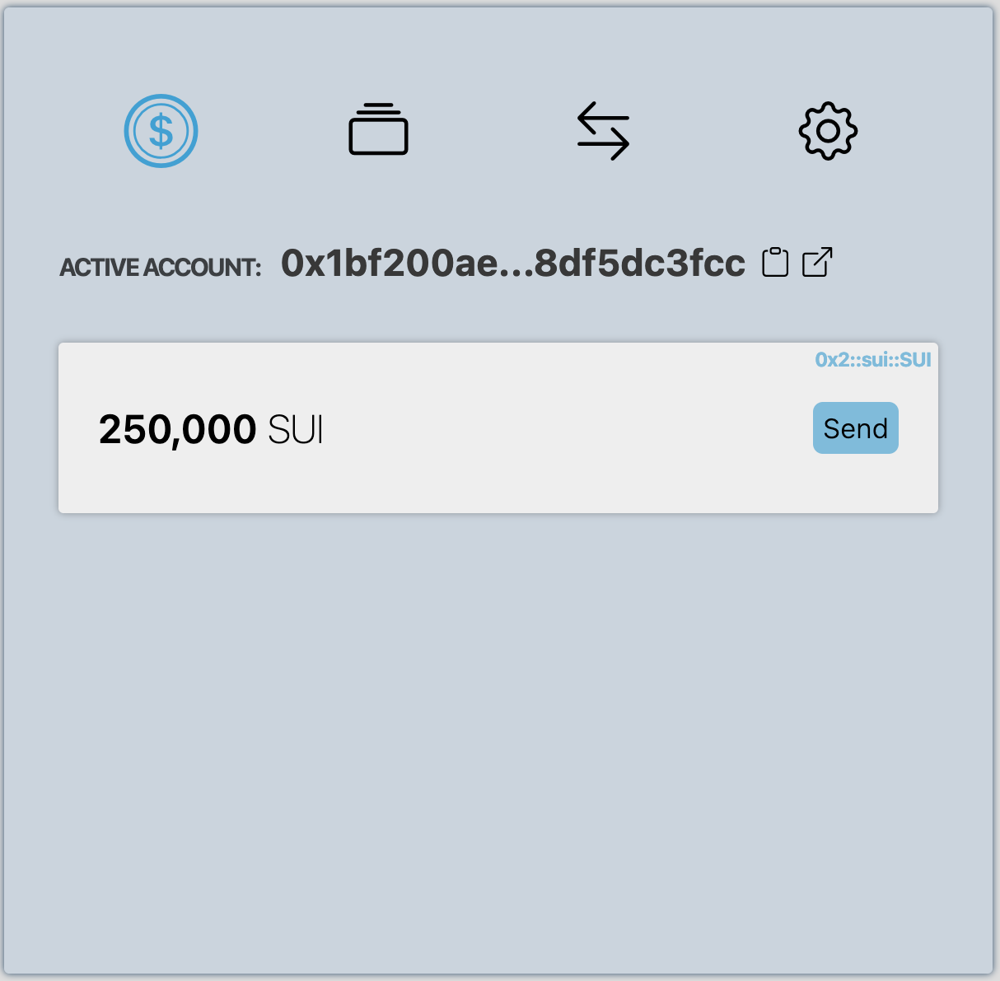
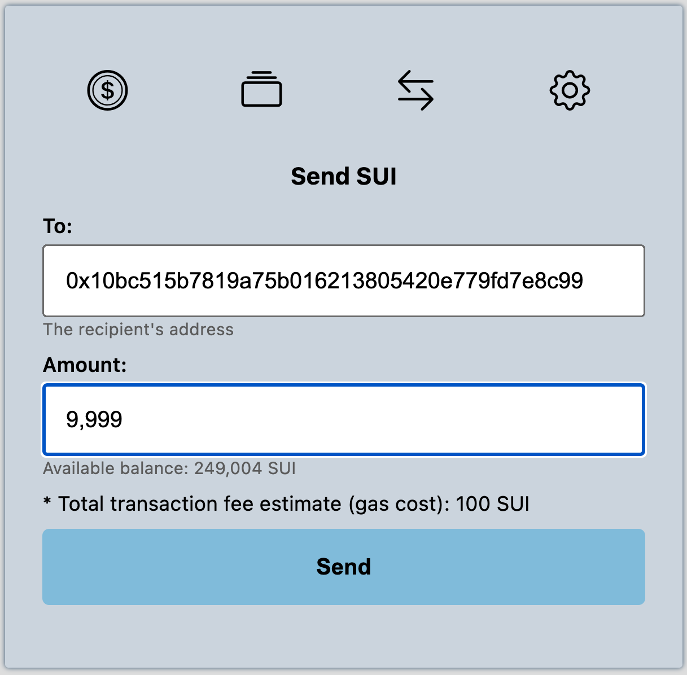
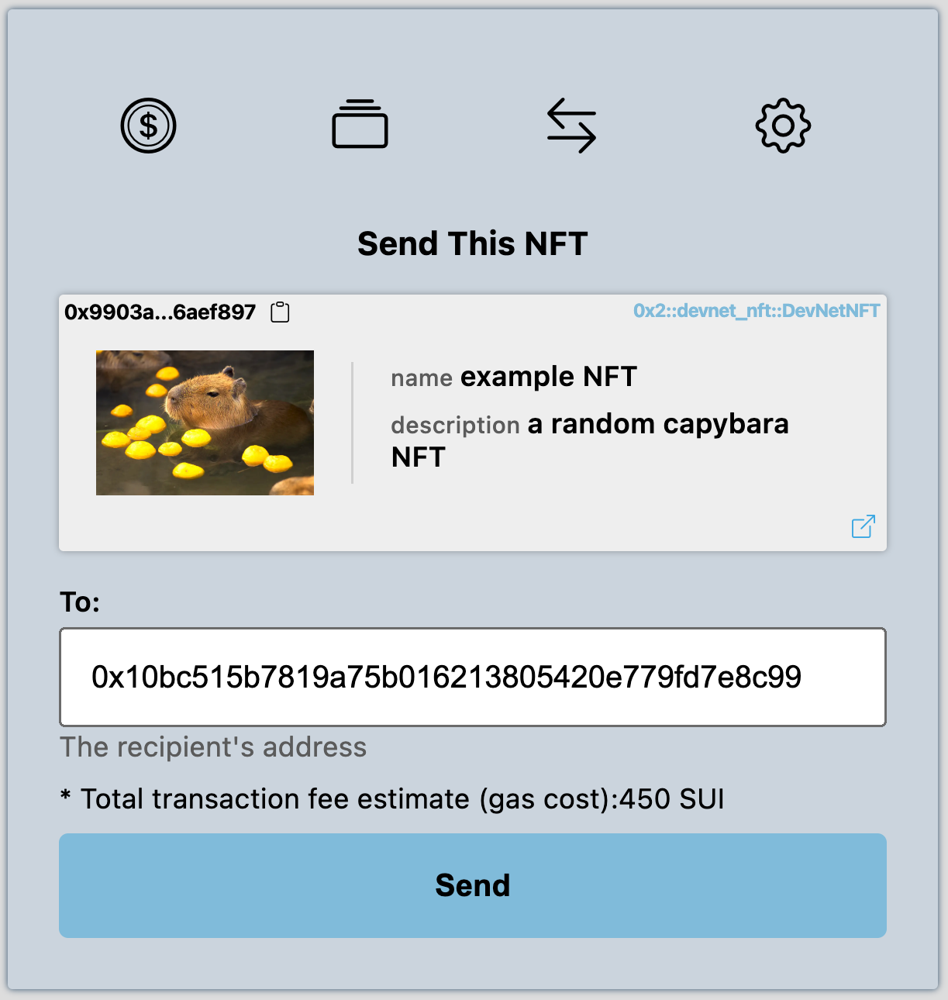
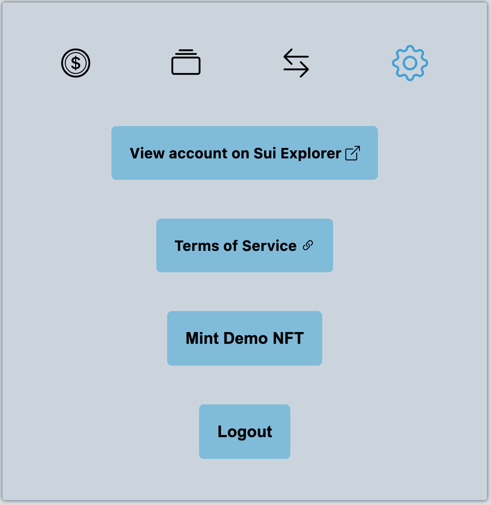

Welcome to the [Haneul Wallet Browser Chrome Extension](https://chrome.google.com/webstore/detail/haneul-wallet/albddfdbohgeonpapellnjadnddglhgn?hl=en&authuser=0) covering its installation and use. The Haneul Wallet Browser Extension acts as your portal to the Web3 world.

## Features

The Haneul Wallet Browser Extension offers these features:

* Create, import, and persistently store the mnemonics and the derived private key
* Transfer coins
* See owned fungible tokens and NFTs
* Display recent transactions
* Go directly to the successful/failed transaction in the Haneul Explorer

Note, the wallet will auto split/merge coins if the address does not have a Coin object with the exact transfer amount. See the [Use](#use) section for guidance on employing these features.

## Purpose

Initially, the Haneul Wallet Browser Extension is aimed at Haneul developers for testing purposes. As such, the tokens are of no value (just like the rest of [DevNet](https://github.com/GeunhwaJeong/haneul/blob/main/doc/src/explore/devnet.md)) and will disappear each time we reset the network. In time, the Haneul Wallet Browser Extension will be production ready for real tokens.

This browser extension is a pared-down version of the [Haneul Wallet command line interface (CLI)](https://github.com/GeunhwaJeong/haneul/blob/main/doc/src/build/wallet.md) that provides greater ease of use for the most commonly used features. If you need more advanced features, such as merge/split coins or make arbitrary [Move](https://github.com/GeunhwaJeong/haneul/blob/main/doc/src/build/move.md) calls, instead use the [Wallet CLI](https://github.com/GeunhwaJeong/haneul/blob/main/doc/src/build/wallet.md).

## Install

To install the Haneul Wallet Browser Extension:
1. Visit its [link in the Chrome Webstore](https://chrome.google.com/webstore/detail/haneul-wallet/albddfdbohgeonpapellnjadnddglhgn?hl=en&authuser=0).
1. Click **Install**.
1. Optionally, [pin the extension](https://www.howtogeek.com/683099/how-to-pin-and-unpin-extensions-from-the-chrome-toolbar/) to add it to your toolbar for easy access.

## Start up

To begin using the Haneul Wallet Browser Extension:
1. Open the extension and click **Get Started**:
   
   *Start up Haneul Wallet Browser Extension*
1. Click **Create new wallet**:
   
   *Create new wallet with Haneul Wallet Browser Extension*
1. Accept the terms of service and click **Create**:
   
   *Accept the terms of service for Haneul Wallet Browser Extension*
1. View and capture the distinct Backup Recovery Passphrase (mnemonic) for the new wallet.
1. Click **Done**.

## Configure

In the Wallet home page, you will see the message _No Tokens Found_:

*Time to populate your wallet*

To finish setting up the Haneul Wallet Browser Extension for testing:
1. From the _Active Account_ in your wallet, copy your **address**:
   
   *Copy your address from the Haneul Wallet Browser Extension*
1. Join [Discord](https://discord.gg/haneul) If you haven’t already.
1. Request tokens in the [#devnet-faucet](https://discord.com/channels/916379725201563759/971488439931392130)
   channel per the [HANEUL tokens](../build/install.md#haneul-tokens) install documentation.
1. Optionally, confirm the transaction in Haneul Explorer:
   
   *See transfer in Haneul Explorer*

## Use

The Haneul Wallet Browser Extension lets you:

* See your account balance by clicking the **Tokens ($)** icon:
   
   *See your account balance in the Haneul Wallet Browser Extension*
* Send coins by clicking **Send** in the _Tokens_ tab:
   
   *Send tokens with the Haneul Wallet Browser Extension*
* Transfer NFTs by clicking **Send NFT** on the _NFT_ tab:
   
   *Send NFTs with the Haneul Wallet Browser Extension*
* View _recent transactions_ by clicking the **Arrow** icon at the top:
   
   *View recent transactions in the Haneul Wallet Browser Extension*
* From the **Settings (gear)** menu, you may:
    * View your account on the Haneul Explorer
    * Mint Demo NFTs
    * See the Haneul terms of service
    * Log out of the Wallet
   
   *Access settings for the Haneul Wallet Browser Extension*
* Go to the [Haneul Explorer](https://explorer.devnet.haneul.io/) view of the current transaction by clicking the external link icon at the bottom right.
