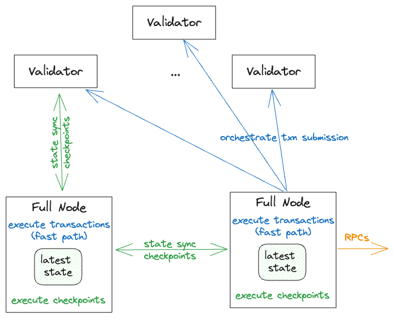

Managing the data on your Haneul Full node is critical to ensuring a healthy Haneul network. This topic provides a high-level description of data management on Haneul Full nodes that you can use to optimize your Full node configuration. To read more in-depth information about data on Haneul Full nodes, such as pruning policies and archival settings, see  [Run a Haneul Full Node](../../build/fullnode.md).

## Basic Haneul Full node functionality

The minimal version of a Haneul Full Node executes all of the transactions committed by Haneul Validators. Haneul Full nodes also orchestrate the submitting  new transactions to the system:



The image shows how data flows through a Full node as follows:
1. **`State sync` protocol:** A Haneul Full node performs the following to achieve state synchronization:
   * Retrieves the information about the committed checkpoints via the p2p gossip-like protocol
   * Executes the transactions locally to verify that effects match the effects certified by the quorum of the validators
   * Updates the local state with the latest object values accordingly.
2. **RPCs:** A Haneul Full node exposes Haneul RPC endpoints for querying the latest state of the system, including both the latest state metadata (such as, `haneul_getProtocolConfig`), and the latest state object data (`haneul_getObject)`.
3. **Transaction submission:** Each Haneul Full node orchestrates transaction submission to the quorum of the Haneul Validators, and, optionally if configured, locally executes the finalized transactions (aka Fast Path execution), which circumvents the wait for checkpoint synchronization.

## Haneul Full node Data and RPC types

A Haneul Full Node stores multiple categories of data in its permanent store. This topic does not cover the per-epoch Haneul store, which is used internally for authority and consensus operations. The per-epoch store resets at the start of each epoch and is outside the scope of this topic.

The data stored by Haneul Full nodes includes the following categories:
1. **Transactions with associated effects and events:** Haneul uses a unique transaction digest to retrieve information about a transaction, including its effects and emitted events. Haneul Full nodes don’t require the historic transaction information for basic Full node operations. To conserve drive space, you can enable pruning to remove this historical data.
2. **Checkpoints:** Haneul groups committed transactions in checkpoints, and then uses those checkpoints to achieve state synchronization. Checkpoints keep transaction digests that contain additional integrity metadata.
Haneul Full nodes don’t require data from checkpoints to  execute and submit transactions, so you can configure pruning for this data as well.
3. **Objects:** Transactions that mutate objects create new object versions. Each object has a unique pair of `(objectId, version)` used to identify the object. Haneul Full nodes don’t require historic object versions to  execute and submit transactions, so you can configure your Full node to also prune this data. 
4. **Indexing information:** A Full node default configuration is to post-process the committed transactions: it indexes the committed information to enable efficient aggregation and filtering queries. For example, the indexing can be useful for retrieving all the historic transactions of a given sender, or finding all the objects owned by an address. 

Haneul Full nodes support a large number (more than 40) RPC types that includes the following categories:
* **General metadata**, such as `haneul_getProtocolConfig` and `haneul_getChainIdentier`. These requests don’t depend on additional indexing and don’t require historic data to process.
* **Direct lookups**, such as `haneul_getObject`, `haneul_getEvents`. These requests don’t depend on additional indexing, but require historic data in some cases, such as `haneul_tryGetPastObject` and `haneul_getTransactionBlock`.
* **Accumulation and filtering queries**,such as `haneulx_getOwnedObjects` and `haneulx_getCoins`. These requests depend on additional indexing, and require historic data in some cases, such as `haneulx_queryTransactionBlocks`.

Haneul’s longer term plan (approximately 6 months) is to migrate the RPC endpoints that require additional indexing away from Haneul  Full nodes. Thus, we’re going to decouple between the storage that is backing transaction execution, and the storage that is better suited for data indexing.

## Haneul Archival data

A Haneul archive instance stores the full Haneul transaction history since genesis in a database agnostic format. This includes information about transactions (with client authentication), effects, events, and checkpoints. As such, archival storage can be used for data auditing and for replaying historic transactions.

**Note:** The current archival storage format doesn’t include historic object versions. 

A Full node operator can [enable archival fallback for their Full node](../../build/fullnode.md#set-up-your-own-archival-fallback) by specifying the URL to upload archival data. Currently, Haneul Labs manages a Haneul archive and stores it in AWS S3. To ensure a healthy network, we encourage the Haneul community to set  up additional archives to ensure archival data availability across the network. In a typical configuration, an archive trails behind the latest checkpoint by approximately 10 minutes.

A Full Node that starts from scratch can replay (and thus re-verify) transactions that occurred since Haneul genesis from the given archive via [configuring Archival Fallback](../../build/fullnode.md#archival-fallback) in the `fullnode.yaml` configuration file to point to the S3 bucket that stores the archive.

A Haneul Full node, which fails to retrieve checkpoints from its peers via state sync protocol, falls back to downloading the missing checkpoints from its pre-configured archive. This fallback enables a FN to catch up with the rest of the system regardless of the pruning policies of its peers.

## Haneul Snapshot data

Haneul Full nodes can use state snapshots to join the system from a given point in time. To do so, the node operator can start from a snapshot, if they trust the historic transaction execution data that was certified by the validators.

Haneul supports two types of snapshots:
* **RocksDB snapshots** are a point-in-time view of a database store. This means that the snapshot keeps the state of the system at the moment it generates the snapshot, including non-pruned data, additional indices, and other data.
* **Formal snapshots** are database agnostic: they keep the state of the system in the minimalistic format. The Formal snapshots also include cryptographic state accumulators, which are certified by the quorum of the validators. These can be verified by the node during the reconstruction. This is one of the main advantages over the RocksDB snapshots, which don’t include any special integrity data certified by a quorum.

You can configure a [Full node snapshot](../../build/snapshot.md) to generate a state snapshot at the end of each epoch. Haneul Labs  currently manages the RocksDB snapshots in AWS S3. To maintain a healthy Haneul network, Haneul encourages the Haneul community to bring up additional snapshots to ensure stronger data availability across the network.

## Haneul Full node pruning policies

As described previously, sustainable disk usage requires Haneul Full nodes to prune the information about historic object versions as well as historic transactions with the corresponding effects and events, including old checkpoint data.

Both transaction and object pruners run in the background. The logical deletion of entries from RocksDB ultimately triggers the physical compaction of data on disk, which is governed by RocksDB background jobs: the pruning effect on disk usage is not immediate and might take multiple days.

To learn more about object pruning policies, see  [Object pruning](../../build/fullnode.md#object-pruning). You can configure the pruner in two modes:
* **aggressive pruning** (`num-epochs-to-retain: 0`): Preferred option. Haneul prunes old object versions as soon as possible.
* **epoch-based pruning** (`num-epochs-to-retain: X`): Haneul prunes old object versions after X epochs.

**Important:** Testing indicates that aggressive pruning results in more efficient Full Node operation.

To learn more about transaction pruning policies, see  [Transaction pruning](../../build/fullnode.md#transaction-pruning). To configure transaction pruning, specify the `num-epochs-to-retain-for-checkpoints: X` config option. The checkpoints, including their transactions, effects and events are pruned up to X epochs ago. We suggest setting transaction pruning to 2 epochs.

### Set an archiving watermark

In case your Full node is configured to upload committed information to an archive, you should ensure that pruning doesn’t occur until after the corresponding data is uploaded. To do so, set the `use-for-pruning-watermark: true` in the Fullnode.yaml file as described in [Archival fallback](../../build/fullnode#archival-fallback).

## Haneul Full node key-value store backup

To enable historic data queries for the Haneul Full nodes that prune old transactional data, Full node RPC implementation is configured to fallback for querying missing transactional data from a remote store.

If the information about the transaction digest, effects, events, or checkpoints is not available locally, a Full node automatically retrieves the historical data from a cloud-based key-value store (currently managed by HaneulLabs). Note that the current key-value store implementation keeps historic transactional data only: we plan to provide support for a similar setup for retrieving the historic object versions in a future release.


## Pruning policy examples

Use the examples in this section to configure your Haneul Full node. You can copy the examples, and then, optionally, modify the values as appropriate for your environment. 

### Minimal Full node

This configuration keeps disk usage to a minimum. A Full node with this configuration cannot answer queries that require indexing or historic data.

```yaml
# Do not generate or maintain indexing of Haneul data on the node
enable-index-processing: false

authority-store-pruning-config:
  # default values
  num-latest-epoch-dbs-to-retain: 3
  epoch-db-pruning-period-secs: 3600
  max-checkpoints-in-batch: 10
  max-transactions-in-batch: 1000
  # end of default values

  # Prune historic object versions
  num-epochs-to-retain: 0
  # Prune historic transactions of the past epochs
  num-epochs-to-retain-for-checkpoints: 2
  periodic-compaction-threshold-days: 1
```

### Full Node with indexing but no history

This setup manages secondary indexing in addition to the latest state, but aggressively prunes historic data. A Full node with this configuration:
* Answers RPC queries that require indexing, like `haneulx_getBalance()`.
* Answers RPC queries that require historic transactions via a fallback to retrieve the data from a remote key-value store: `haneul_getTransactionBlock()`.
* Cannot answer RPC queries that require historic object versions: `haneul_tryGetPastObject()`.
  * Note that the `showBalanceChanges` filter of `haneul_getTransactionBlock()` query relies on historic object versions, so it can’t work with this configuration.

```yaml
authority-store-pruning-config:
  # default values
  num-latest-epoch-dbs-to-retain: 3
  epoch-db-pruning-period-secs: 3600
  max-checkpoints-in-batch: 10
  max-transactions-in-batch: 1000
  # end of default values

  # Prune historic object versions
  num-epochs-to-retain: 0
  # Prune historic transactions of the past epochs
  num-epochs-to-retain-for-checkpoints: 2
  periodic-compaction-threshold-days: 1
```

### Full Node with full object history but pruned transaction history

This configuration manages the full object history while still pruning historic transactions. A Full node with this configuration can answer all historic and indexing queries (using the transaction query fallback for transactional data), including the ones that require historic objects such as the `showBalanceChanges` filter of `haneul_getTransactionBlock()`.

The main caveat is that the current setup enables **transaction pruner** to go ahead of **object pruner**. The object pruner might not be able to properly clean up the objects modified by the transactions that have been already pruned. You should closely monitor the disk space growth on a Full node with this configuration.

In addition to the regular (pruned) snapshots, Haneul Labs also maintains special RocksDB snapshots with full history of object versions available for the operators using this configuration.

```yaml
authority-store-pruning-config:
  # default values
  num-latest-epoch-dbs-to-retain: 3
  epoch-db-pruning-period-secs: 3600
  max-checkpoints-in-batch: 10
  max-transactions-in-batch: 1000
  # end of default values

  # No pruning of object versions (use u64::max for num of epochs)
  num-epochs-to-retain: 18446744073709551615
  # Prune historic transactions of the past epochs
  num-epochs-to-retain-for-checkpoints: 2
  periodic-compaction-threshold-days: 1
```