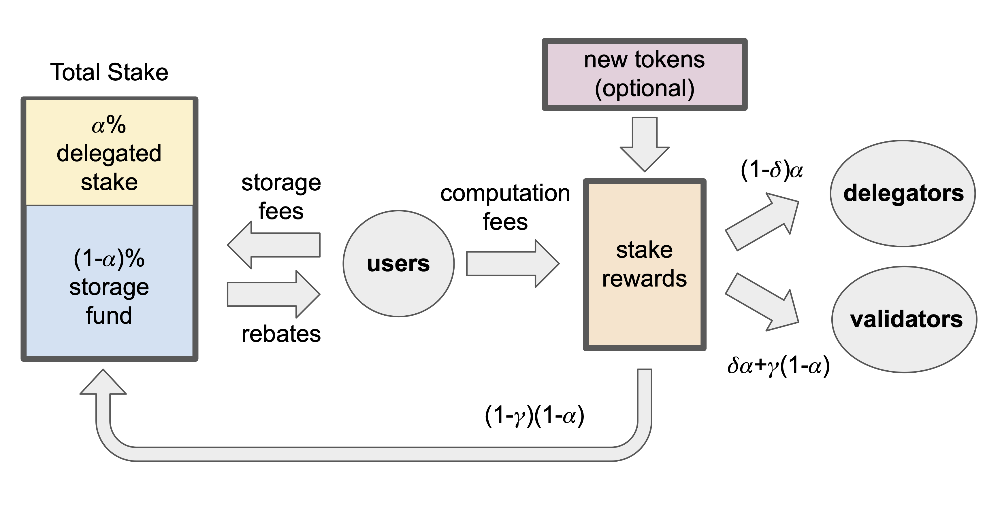

Haneul’s tokenomics are designed at the frontier of economic blockchain research, aiming to deliver an economic ecosystem and financial plumbing at par with Haneul’s leading engineering design. 

This page includes a high-level overview of Haneul’s economic model. For further details, refer to the tokenomics white paper: [The Haneul Smart Contracts Platform: Economics and Incentives](https://github.com/GeunhwaJeong/haneul/blob/main/doc/paper/tokenomics.pdf).

## The Haneul economy

The Haneul economy is characterized by three main sets of participants:

* **Users** submit transactions to the Haneul platform in order to create, mutate, and transfer digital assets or interact with more sophisticated applications enabled by smart contracts, interoperability, and composability.
* **HANEUL token holders** bear the option of delegating their tokens to validators and participating in the proof-of-stake mechanism. HANEUL owners also hold the rights to participate in Haneul’s governance.
* **Validators** manage transaction processing and execution on the Haneul platform.

The Haneul economy has five core components:

* The [HANEUL token](../tokenomics/haneul-token.md) is the Haneul platform’s native asset. 
* [Gas fees](../tokenomics/gas-pricing.md) are charged on all network operations and used to reward participants of the proof-of-stake mechanism and prevent spam and denial-of-service attacks.
* [Haneul’s storage fund](../tokenomics/storage-fund.md) is used to shift stake rewards across time and compensate future validators for storage costs of previously stored on-chain data.
* The [proof-of-stake mechanism](../tokenomics/proof-of-stake.md) is used to select, incentivize, and reward honest behavior by the Haneul platform’s operators – i.e. validators and the HANEUL delegators.
* On-chain voting is used for governance and protocol upgrades.

Throughout, we use the visual representation in the following figure to aid the discussion. 

*Visualize staking and tokenomics in Haneul*
