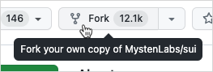
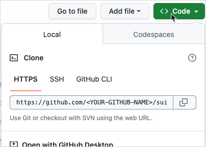

Before you start developing with Haneul and Move, you should familiarize yourself with how to contribute to Haneul, how Haneul is structured, what tools and SDKs exist, and what plugins are available to use in your IDE.

## Fork the Haneul repository {#fork}

The recommended way to contribute to the Haneul repository is to fork the project, make changes on your fork, then submit a pull request (PR). The Haneul repository is available on GitHub: https://github.com/GeunhwaJeong/haneul.

To create a local Haneul repository:

1. Go to the [Haneul repository](https://github.com/GeunhwaJeong/haneul) on GitHub.
1. Click the **Fork** button to create a copy of the repository in your account.

    

1. In your forked repository on GitHub, click the green `Code <>` button and copy the **HTTPS** URL GitHub provides.

    

1. Open a terminal or console on your system at the location you want to save the repository locally. Type `git clone ` and paste the URL you copied in the previous step and press `Enter`.
1. Type `cd haneul` to make `haneul` the active directory.

You can use any [branching strategy](https://docs.github.com/en/pull-requests/collaborating-with-pull-requests/proposing-changes-to-your-work-with-pull-requests/creating-and-deleting-branches-within-your-repository) you prefer on your Haneul fork. Make your changes locally and push to your repository, submitting PRs to the official Haneul repository from your fork as needed.

:::tip

Be sure to synchronize your fork frequently to keep it up-to-date with active development.

:::


## Using Haneul from command line

You can interact with the Haneul network through two official SDKs (TypeScript SDK and Rust SDK), and by using the Haneul CLI. For more details about using the Haneul CLI, see [Install Haneul](./haneul-install.mdx) and the [Haneul CLI](/references/cli.mdx) reference.

## Move IDEs and plugins

The recommended IDE for Move development is Visual Studio Code with the `move-analyzer` extension. Follow the Visual Studio Marketplace instructions to install the move-analyzer extension, then install the `move-analyzer` language server passing `address32` using the `--features` flag and passing `haneul-move` to the branch flag:

```shell
cargo install --git https://github.com/move-language/move move-analyzer --branch haneul-move --features "address32"
```

See more [IDE options](https://github.com/GeunhwaJeong/awesome-move#ides) in the [Awesome Move](https://github.com/GeunhwaJeong/awesome-move) documentation.

After you install VS Code and the `move-analyzer` extension, check out the [Move code examples](https://github.com/GeunhwaJeong/haneul/tree/main/examples/move).

To test or run a Move example on Haneul, use the `haneul move` command from the Haneul CLI.

## Haneul repository and how to contribute

The Haneul repo is a monorepo, containing all the source code that is used to build and run the Haneul network, as well as this documentation.

The root folder of the Haneul monorepo has the following top-level folders:

- [apps](https://github.com/GeunhwaJeong/haneul/tree/main/apps): Contains the source code for the main web applications that Haneul Labs runs, such as the `haneulexplorer.com` or the `Haneul Wallet`.
- [crates](https://github.com/GeunhwaJeong/haneul/tree/main/crates): Contains all the Rust crates that are part of the Haneul system.
- [dapps](https://github.com/GeunhwaJeong/haneul/tree/main/dapps): Contains some examples of decentralized applications built on top of Haneul, such as Kiosk or Sponsored Transactions.
- [dashboards](https://github.com/GeunhwaJeong/haneul/tree/main/dashboards): Currently empty.
- [doc](https://github.com/GeunhwaJeong/haneul/tree/main/doc): Contains deprecated documentation related to Move and Haneul.
- [docker](https://github.com/GeunhwaJeong/haneul/tree/main/docker): Contains the docker files needed to spin up a node, an indexer, a Full node or other services.
- [docs](https://github.com/GeunhwaJeong/haneul/tree/main/docs): Contains this documentation and the source for this site.
- [examples](https://github.com/GeunhwaJeong/haneul/tree/main/examples): Contains examples of apps written for Haneul and smart contracts written in Move.
- [external-crates](https://github.com/GeunhwaJeong/haneul/tree/main/external-crates): Contains the source code for the Move programming language.
- [kiosk](https://github.com/GeunhwaJeong/haneul/tree/main/kiosk): Contains the source code of the Haneul Labs Kiosk extensions and rules, as well as examples.
- [narwhal](https://github.com/GeunhwaJeong/haneul/tree/main/narwhal): Contains the source code of Narwhal and partially synchronous Bullshark, a DAG-based mempool, and efficient BFT consensus.
- [nre](https://github.com/GeunhwaJeong/haneul/tree/main/nre): Contains information about node and network reliability engineering.
- [scripts](https://github.com/GeunhwaJeong/haneul/tree/main/scripts): Contains a number of scripts that are used internally.
- [sdk](https://github.com/GeunhwaJeong/haneul/tree/main/sdk): Contains the source code for different tools and SDKs, such as the Haneul TypeScript SDK, Kiosk SDK, BCS, zkLogin, dApp kit, and others.
- [haneul-execution](https://github.com/GeunhwaJeong/haneul/tree/main/haneul-execution): Contains the source code responsible for abstracting access to the execution layer.

The following primary directories offer a good starting point for exploring the Haneul codebase:

- [explorer](https://github.com/GeunhwaJeong/haneul/tree/main/apps/explorer) - Browser-based object explorer for the Haneul network. See the deployed application [here](https://haneulexplorer.com).
- [move](https://github.com/GeunhwaJeong/haneul/tree/main/external-crates/move) - Move VM, compiler, and tools.
- [narwhal](https://github.com/GeunhwaJeong/haneul/tree/main/narwhal) - Mempool and consensus.
- [typescript-sdk](https://github.com/GeunhwaJeong/haneul/tree/main/sdk/typescript/) - the Haneul TypeScript SDK.
- [wallet](https://github.com/GeunhwaJeong/haneul/tree/main/apps/wallet) - Chrome extension wallet for Haneul.
- [haneul](https://github.com/GeunhwaJeong/haneul/tree/main/crates/haneul) - the Haneul command line tool.
- [haneul-core](https://github.com/GeunhwaJeong/haneul/tree/main/crates/haneul-core) - Core Haneul components.
- [haneul-execution](https://github.com/GeunhwaJeong/haneul/tree/main/haneul-execution) - Execution Layer (programmable transactions, execution integration).
- [haneul-framework](https://github.com/GeunhwaJeong/haneul/tree/main/crates/haneul-framework) - Move system packages (0x1, 0x2, 0x3, 0xdee9).
- [haneul-network](https://github.com/GeunhwaJeong/haneul/tree/main/crates/haneul-network) - Networking interfaces.
- [haneul-node](https://github.com/GeunhwaJeong/haneul/tree/main/crates/haneul-node) - Validator and Full node software.
- [haneul-protocol-config](https://github.com/GeunhwaJeong/haneul/tree/main/crates/haneul-protocol-config) - On-chain system configuration and limits.
- [haneul-sdk](https://github.com/GeunhwaJeong/haneul/tree/main/crates/haneul-sdk) - The Haneul Rust SDK.
- [haneul-types](https://github.com/GeunhwaJeong/haneul/tree/main/crates/haneul-types) - Haneul object types, such as coins and gas.

## Development branches

The Haneul repository includes four primary branches: `devnet`, `testnet`, `mainnet`, and `main`.

The `devnet` branch includes the latest stable build of Haneul. Choose the `devnet` branch if you want to build or test on Haneul Devnet. If you encounter an issue or find a bug, it may already be fixed in the `main` branch. To submit a PR, you should push commits to your fork of the `main` branch.

The `testnet` branch includes the code running on the Haneul Testnet network.

The `mainnet` branch includes the code running on the Haneul Mainnet network.

The `main` branch includes the most recent changes and updates. Use the `main` branch if you want to contribute to the Haneul project or to experiment with cutting-edge functionality. The `main` branch might include unreleased changes and experimental features, so use it at your own risk.
